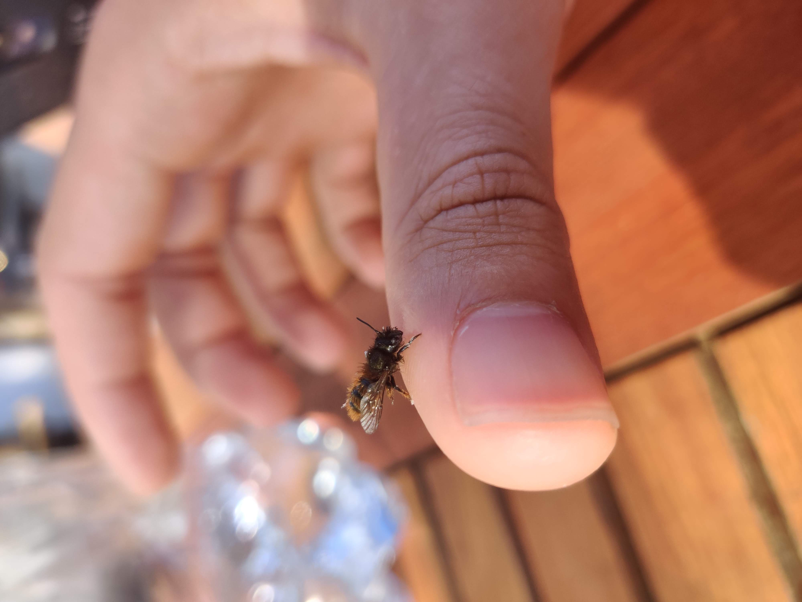
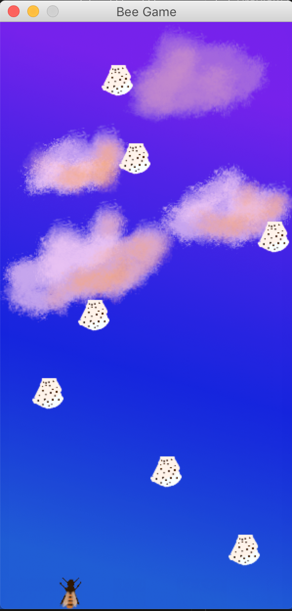
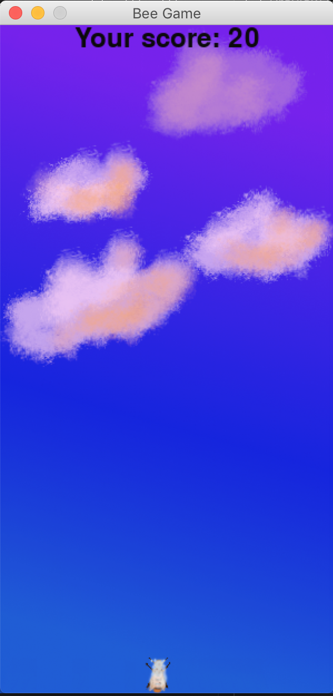

# Bee-game
A game with a bee developed with pygame during one mother's day evening.

When having ice-cream one hot mother's day sunday my father had a visitor dive into his ice-cream.

This little fella hung around on my thumb for 10 minutes cleaning out the ice-cream before getting away to pollinate more flowers. That prompted me to make this little game where the bee tries to dodge the ice-cream falling down from the sky. I made some sloppy "art" in Gimp with varying quality.

If you happen to get struck the bee is covered with ice-cream and and you're presented with your score.

